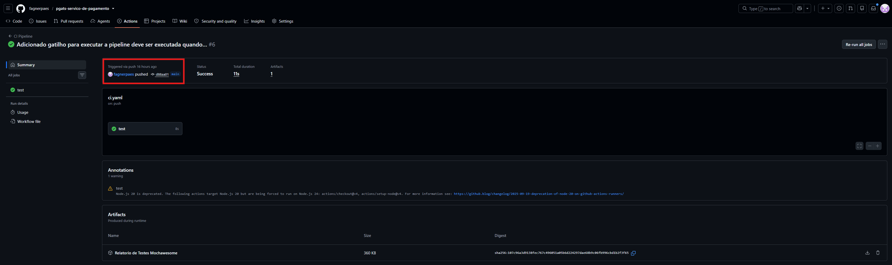
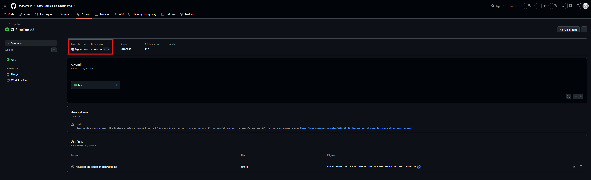
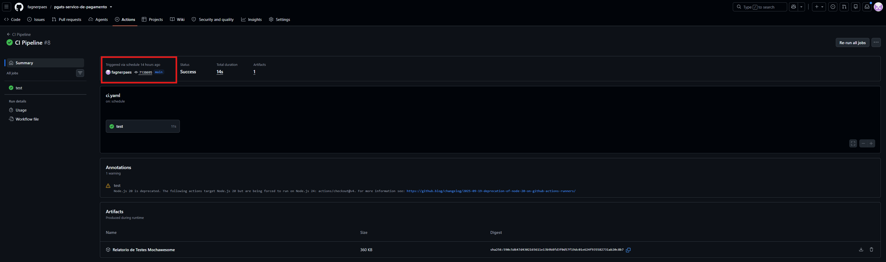

# Objetivo do Projeto

Este projeto foi desenvolvido inicialmente como avaliação da disciplina **Programação para Automação de Testes** do curso de **Pós-Graduação em Automação de Testes (PGATS)**, promovido pelo [**Júlio de Lima**](https://www.linkedin.com/in/juliodelimas).

Posteriormente, o mesmo projeto passou a ser utilizado também como avaliação da disciplina **Integração Contínua para Automação de Testes**, ministrada pelo [**Professor Goku — João Vitor dos Santos**](https://www.linkedin.com/in/qakarotto/). Assim, o repositório passou a contemplar tanto a implementação da solução quanto sua evolução para atender aos requisitos da disciplina de integração contínua.


Mais informações sobre o curso podem ser encontradas no site oficial: [https://pgats.com.br/](https://pgats.com.br/).


# Serviço de Pagamento

Classe para gerenciar pagamentos com categorização automática baseada no valor.

## Descrição

Crie uma classe que possua dois métodos: um para realizar pagamento e outro para consultar o último pagamento. 
Pagamentos serão armazenados como objetos Javascript dentro de uma lista de pagamentos. 
Cada pagamento terá as propriedades: Código de Barras, Empresa e Valor. 
Quando um pagamento for realizado e o valor for maior que 100.00, o pagamento também terá a propriedade 
'categoria' preenchida pela função como 'cara', caso contrário, a propriedade 'categoria' será preenchida pela 
função como 'padrão'. O método de consultar trará apenas o último pagamento.
  
  ex. 
  const servicoDePagamento = new ServicoDePagamento();
  servicoDePagamento.pagar('0987-7656-3475', 'Samar', 156.87);
  console.log(servicoDePagamento.consultarUltimoPagamento());
  {
     codigoBarras: '0987-7656-3475',
     empresa: 'Samar',
     valor: 56.87,
     categoria: 'cara'
  }
  
  A entregua deve ser realizada via Github e o repositório deve ter a classe a pasta src e os testes dos métodos dessa classe dentro da pasta test usando Mocha e Node Assert. 


Este projeto implementa uma classe `ServicoDePagamento` que possibilita:
- Realizar pagamentos com código de barras, empresa e valor
- Categorizar pagamentos automaticamente como "cara" (valor > 100.00) ou "padrão"
- Consultar o último pagamento realizado

## Instalação

```bash
npm install
```

## Executar Testes Unitários

Para executar os testes unitários, utilize o comando:

```bash
npm test
```

Os testes são executados com **Mocha** e **Node Assert**, validando:
- Pagamentos com categoria "cara" (valor > 100.00)
- Pagamentos com categoria "padrão" (valor ≤ 100.00)
- Consulta do último pagamento realizado

## Estrutura do Projeto

```
pgats-servico-de-pagamento/
├── .github/
│   └── workflows/
│       └── ci.yaml                     # Workflow de CI/CD com GitHub Actions
├── docs/
│   └── screenshots/                    # Evidências das execuções da pipeline
|   └── reports/                        # Relatórios de testes armazenados apenas para avaliação da disciplina de Integração Contínua  
├── mochawesome-report/                 # Relatórios de testes gerados
│   ├── mochawesome.html                # Relatório HTML dos testes
│   ├── mochawesome.json                # Relatório JSON dos testes
│   └── assets/                         # Arquivos de estilo e scripts
├── src/
│   └── servicoDePagamento.js           # Classe principal
├── test/
│   └── servicoDePagamento.test.js      # Testes unitários
├── package.json                        # Configuração do projeto e dependências
├── package-lock.json                   # Lock file do npm
└── README.md                           # Documentação do projeto
```

**Descrição dos Diretórios:**

- **`.github/workflows/`**: Contém os arquivos de configuração do GitHub Actions
  - `ci.yaml`: Define a pipeline de integração contínua com os gatilhos (push, manual, agendado), passos e artefatos

- **`docs/`**: Documentação adicional do projeto
  - `screenshots/`: Armazena as evidências (print screens) das execuções da pipeline
  - `reports/`: Armazena os relatórios de testes gerados durante a avaliação da disciplina de Integração Contínua 

- **`mochawesome-report/`**: Relatórios de testes gerados automaticamente
  - `mochawesome.html`: Relatório interativo em HTML
  - `mochawesome.json`: Dados brutos dos testes em formato JSON
  - `assets/`: Estilos CSS e scripts JavaScript para o relatório

- **`src/`**: Código fonte da aplicação
  - `servicoDePagamento.js`: Implementação da classe de pagamentos

- **`test/`**: Testes automatizados
  - `servicoDePagamento.test.js`: Suite de testes unitários com Mocha


## Requisitos

- Node.js (versão 12 ou superior)
- npm

## Dependências

- **mocha**: Framework de testes
- **assert**: Módulo nativo do Node.js para assertions


## Integração Contínua - GitHub Actions

### Visão Geral

Este projeto implementa uma pipeline de Integração Contínua (CI) utilizando **GitHub Actions**, conforme requisitos da disciplina de **Integração Contínua para Automação de Testes**. A pipeline automatiza a execução de testes e geração de relatórios em cada alteração do código.

### Arquivo de Configuração

O arquivo de configuração está localizado em `.github/workflows/ci.yaml` e define a pipeline de CI com as seguintes características:

**Gatilhos de Execução:**
- ✅ **Push para branch main**: A pipeline executa automaticamente quando há um push na branch principal
- ✅ **Execução Manual**: Permite disparar a pipeline manualmente via `workflow_dispatch`
- ✅ **Agendamento**: Executa automaticamente toda sexta-feira às 17h18 (cron: `'18 17 * * 5'`)

**Passos da Pipeline:**

1. **Checkout do Código**: Faz o clone do repositório usando `actions/checkout@v4`
2. **Configuração do Node.js**: Instala Node.js versão 24.x com cache de dependências npm via `actions/setup-node@v6`
3. **Instalação de Dependências**: Executa `npm ci` para instalar as dependências de forma consistente
4. **Execução dos Testes**: Executa `npm test` para rodar todos os testes automatizados
5. **Geração de Relatório**: Executa `npm run test:report` para gerar relatório com Mochawesome
6. **Publicação de Artefatos**: Realiza o upload da pasta `mochawesome-report` como artefato da pipeline com retenção de 7 dias via `actions/upload-artifact@v7`

**Ambiente de Execução:**
- Sistema operacional: Ubuntu (ubuntu-latest)
- Cache habilitado para as dependências npm, melhorando a performance em execuções subsequentes

### Atendimento dos Objetivos

| Objetivo | Status | Descrição |
|----------|--------|-----------|
| Execução por push | ✅ Atendido | Pipeline dispara automaticamente em push para a branch main |
| Execução manual | ✅ Atendido | `workflow_dispatch` permite execução manual da pipeline |
| Execução agendada | ✅ Atendido | Cron configurado para toda sexta-feira às 17h18 |
| Geração de relatório de testes | ✅ Atendido | `npm run test:report` gera relatório Mochawesome em JSON e HTML |
| Armazenamento/publicação do relatório | ✅ Atendido | Artefato publicado via GitHub Actions com 7 dias de retenção |
| Documentação completa | ✅ Atendido | README explicando a solução e os conceitos utilizados |

### Conceitos Utilizados

- **CI/CD (Continuous Integration)**: Automatização de testes e builds em cada alteração
- **GitHub Actions**: Plataforma de automação nativa do GitHub
- **Workflows**: Fluxos de trabalho automatizados disparados por eventos
- **Artefatos**: Arquivos gerados pela pipeline que podem ser armazenados e recuperados
- **Cron Jobs**: Agendamento de tarefas em intervalos específicos

---

## Evidências das Execuções da Pipeline

Esta seção documenta as evidências das diferentes formas de execução da pipeline de CI/CD.

### 1. Execução por Push

**Descrição**: A pipeline é acionada automaticamente quando há um push para a branch `main`.

**Print Screen da Execução por Push:**




---

### 2. Execução Manual (Workflow Dispatch)

**Descrição**: A pipeline pode ser disparada manualmente através da aba Actions do repositório.

**Print Screen da Execução Manual:**



**Como Executar Manualmente:**
1. Acesse a aba **Actions** no repositório GitHub
2. Selecione o workflow **CI Pipeline**
3. Clique em **Run workflow**
4. Selecione a branch (main)
5. Clique em **Run workflow**

---

### 3. Execução Agendada (Scheduled)

**Descrição**: A pipeline executa automaticamente toda sexta-feira às 17h18 UTC conforme configuração do cron job.

**Print Screen da Execução Agendada:**



**Configuração Cron**: `'18 17 * * 5'`
- Minuto: 18
- Hora: 17
- Dia do mês: * (qualquer dia)
- Mês: * (qualquer mês)
- Dia da semana: 5 (sexta-feira)

---

### Como Acessar os Relatórios Detalhados

**Via GitHub Actions (Recomendado):**
1. Acesse a aba **Actions** do repositório
2. Clique na execução desejada
3. Role para baixo até a seção **Artifacts**
4. Clique em **Relatorio de Testes Mochawesome** para fazer o download
5. Extraia o arquivo ZIP
6. Abra `mochawesome.html` em um navegador web

Observação: Caso a retenção do artefato tenha expirado, o relatório pode ser encontrado na pasta do projeto .\docs\reports\    

---